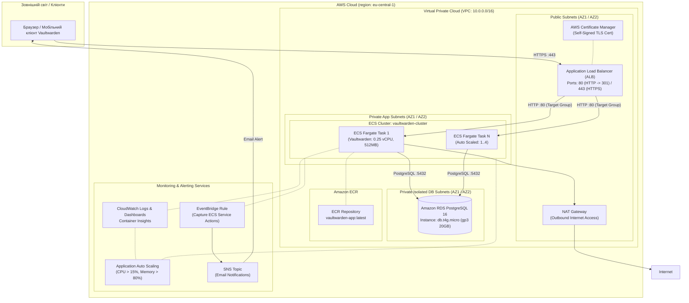

```mermaid
flowchart TB
    subgraph ClientSpace [" Зовнішній світ / Клієнти "]
        User["Браузер / Мобільний клієнт Vaultwarden"]
    end

    subgraph AWS [" AWS Cloud (region: eu-central-1) "]
        subgraph VPC [" Virtual Private Cloud (VPC: 10.0.0.0/16) "]
            
            subgraph PublicSubnets [" Public Subnets (AZ1 / AZ2) "]
                ALB["Application Load Balancer (ALB)<br/>Ports: 80 (HTTP -> 301) / 443 (HTTPS)"]
                ACM["AWS Certificate Manager<br/>(Self-Signed TLS Cert)"]
                NAT["NAT Gateway<br/>(Outbound Internet Access)"]
            end

            subgraph PrivateAppSubnets [" Private App Subnets (AZ1 / AZ2) "]
                subgraph ECSCluster [" ECS Cluster: vaultwarden-cluster "]
                    Fargate1["ECS Fargate Task 1<br/>(Vaultwarden: 0.25 vCPU, 512MB)"]
                    Fargate2["ECS Fargate Task N<br/>(Auto Scaled: 1..4)"]
                end
            end

            subgraph IsolatedDBSubnets [" Private Isolated DB Subnets (AZ1 / AZ2) "]
                RDS[("Amazon RDS PostgreSQL 16<br/>Instance: db.t4g.micro (gp3 20GB)")]
            end

            subgraph ECRSpace [" Amazon ECR "]
                ECR["ECR Repository<br/>vaultwarden-app:latest"]
            end

        end

        subgraph Management [" Monitoring & Alerting Services "]
            CW["CloudWatch Logs & Dashboards<br/>Container Insights"]
            AutoScaling["Application Auto Scaling<br/>(CPU > 15%, Memory > 80%)"]
            EventBridge["EventBridge Rule<br/>(Capture ECS Service Actions)"]
            SNS["SNS Topic<br/>(Email Notifications)"]
        end
    end

    %% Connections
    User -->|"HTTPS :443"| ALB
    ACM -.- ALB
    ALB -->|"HTTP :80 (Target Group)"| Fargate1
    ALB -->|"HTTP :80 (Target Group)"| Fargate2
    
    Fargate1 -->|"PostgreSQL :5432"| RDS
    Fargate2 -->|"PostgreSQL :5432"| RDS

    Fargate1 -.- ECR
    Fargate1 --> NAT
    NAT --> ExternalInternet["Internet"]

    %% Metrics & Monitoring
    Fargate1 -.- CW
    CW -.- AutoScaling
    AutoScaling -.- ECSCluster
    ECSCluster -.- EventBridge
    EventBridge --> SNS
    SNS -->|"Email Alert"| User
```